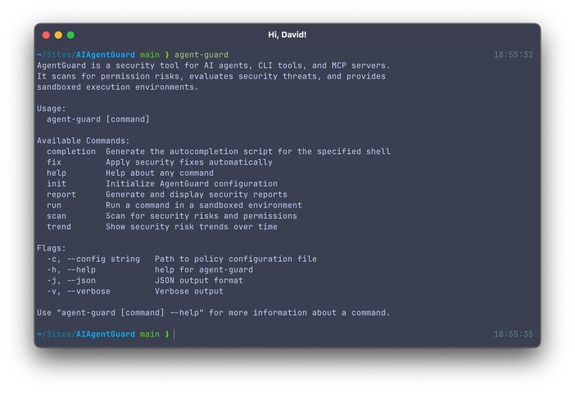
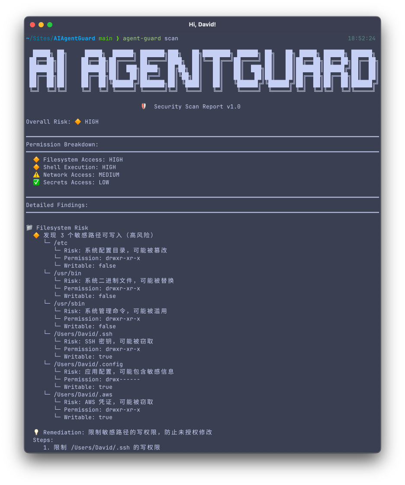

# AI AgentGuard

[]


## 截图展示
<div align="center">
  
  
  <p><strong>AI AgentGuard 是一种面向 AI 代理、CLI 工具和 MCP 服务器的安全检测工具。它扫描权限风险，评估安全威胁，并提供沙箱执行环境。</strong></p>
  <p><a href="README.md">English</a> | <a href="README_zh.md">简体中文</a></p>
</div>

## 功能特性

### 核心安全扫描
- **权限扫描** - 检测文件系统、Shell、网络和机密访问权限
- **文件内容分析** - 扫描文件中的暴露 API 密钥、令牌和机密信息（15+ 种模式）
- **进程安全监控** - 检测反向 shell、可疑进程和高 CPU 使用率
- **SUID/SGID 扫描** - 识别特权可执行文件和潜在的权限提升向量

### 高级功能（v1.3.0 新增）⭐
- **详细安全报告** - 显示造成安全风险的具体文件、进程和命令
- **进程扫描详情** - 识别可疑进程，显示 PID、命令行和风险原因
- **网络连接分析** - 显示开放端口和活跃连接，附带安全评估
- **自动修复向导** - 自动修复安全问题或提供手动修复命令
- **风险趋势分析** - 对比历史扫描结果，追踪安全态势变化
- **多语言依赖漏洞扫描** - 支持 Go、npm、pip、cargo 依赖漏洞扫描
- **Prometheus 监控** - 导出指标用于监控和告警
- **Web UI 仪表板** - 可视化安全监控，支持实时更新
- **多语言支持 (i18n)** - 自动检测系统语言，支持中英文输出

### v1.2.0 功能
- **多语言依赖漏洞扫描** - 支持 Go、npm、pip、cargo 依赖漏洞扫描
- **Prometheus 监控** - 导出指标用于监控和告警
- **Go 依赖漏洞扫描** - 使用 golang.org/x/vuln 检查已知 CVE
- **容器运行时检测** - 检测 Docker、Kubernetes、Podman、LXC、Wasm
- **真·沙盒隔离** - 基于 containerd 的容器隔离（仅 Linux）

### v1.1.0 功能
- **依赖漏洞扫描** - 使用 golang.org/x/vuln 检查 Go 依赖中的已知 CVE 漏洞
- **容器运行时检测** - 检测 Docker、Kubernetes、Podman、LXC、Wasm 环境
- **真·沙盒隔离** - 基于 containerd 的容器隔离，使用 Linux 命名空间（仅 Linux）

### 安全与合规
- **审计日志** - 全面的安全事件日志，支持 JSON 格式和 SIEM 集成
- **风险评估** - 智能分析安全威胁并计算风险等级（85%+ 覆盖率）
- **智能命令解析** - 高级标志解析，防止绕过尝试
- **沙箱执行** - 在隔离环境中安全运行命令

### 配置与防护
- **策略管理** - 通过 YAML 配置文件控制访问权限
- **提示注入防护** - 检测和阻止恶意提示注入攻击
- **插件扫描** - 检测不安全的插件和扩展

## 更新方式

更新到最新版本：

**Homebrew**:
```bash
brew upgrade agent-guard
```

**安装脚本**:
```bash
curl -sSL https://raw.githubusercontent.com/imdlan/AIAgentGuard/main/scripts/install.sh | bash
```

**手动下载**: 从 [Releases](https://github.com/imdlan/AIAgentGuard/releases/latest) 下载。
## 安装方式

### 方式 1: Homebrew（推荐 macOS/Linux）

```bash
brew tap imdlan/AIAgentGuard
brew install agent-guard
```

### 方式 2: 从 GitHub Releases 下载

访问 [Releases 页面](https://github.com/imdlan/AIAgentGuard/releases) 下载对应平台的二进制文件。

```bash
# macOS / Linux
curl -LO https://github.com/imdlan/AIAgentGuard/releases/latest/download/agent-guard_darwin_arm64.tar.gz
tar -xzf agent-guard_darwin_arm64.tar.gz
chmod +x agent-guard
sudo mv agent-guard /usr/local/bin/
```

### 方式 3: Go Install（开发者）

```bash
go install github.com/imdlan/AIAgentGuard@latest
```

确保 `$GOPATH/bin` 在你的 `PATH` 中：
```bash
export PATH=$PATH:$(go env GOPATH)/bin
```

### 方式 4: 安装脚本

```bash
curl -sSL https://raw.githubusercontent.com/imdlan/AIAgentGuard/main/scripts/install.sh | bash
```

### 方式 5: 从源码编译

```bash
git clone https://github.com/imdlan/AIAgentGuard.git
cd agent-guard
go build -o agent-guard
sudo mv agent-guard /usr/local/bin/
```

## 快速开始

### 1. 扫描安全风险

```bash
# 扫描当前环境
agent-guard scan

# JSON 格式输出
agent-guard scan --json

# 使用自定义策略
agent-guard scan --config ./my-policy.yaml
```

### 2. 沙箱执行

```bash
# 在隔离环境中运行命令
agent-guard run "curl https://api.example.com"

# 禁用网络访问
agent-guard run --disable-network "npm install"

# 限制文件系统访问
agent-guard run --allow-dirs /tmp,/data "node script.js"
```

### 3. 生成报告

```bash
# 生成详细报告
agent-guard report

# 保存到文件
agent-guard report --json > security-report.json
```

### 4. Prometheus 监控（新增）

```bash
# 使用 Prometheus 指标运行扫描
agent-guard scan --metrics-addr :9090

# 指标可在 http://localhost:9090/metrics 获取
# curl http://localhost:9090/metrics
```

详细监控设置请参阅[监控指南](doc/MONITORING.md)。

### 5. 初始化配置

```bash
# 生成默认配置文件
agent-guard init

# 配置文件位置：
# - .agent-guard.yaml (当前目录)
# - ~/.agent-guard.yaml (用户目录)
# - /etc/agent-guard/config.yaml (系统目录)
```

## 配置示例

创建 `.agent-guard.yaml`：

```yaml
# 禁用危险命令
blocked_commands:
  - "rm -rf /"
  - "dd if=/dev/zero"
  - "mkfs"
  - ":(){ :|:& };:"  # fork bomb

# 限制文件系统访问
allowed_paths:
  - /tmp
  - /home/user/project
  - /var/log/app

denied_paths:
  - /etc/passwd
  - /etc/shadow
  - ~/.ssh

# 环境变量保护
blocked_env_vars:
  - API_KEY
  - SECRET_TOKEN
  - DATABASE_URL

# 网络访问控制
network:
  allowed_domains:
    - api.github.com
    - cdn.jsdelivr.net
  denied_domains:
    - "*.malicious.com"
```

## 输出示例

```
  █████╗ ██╗     █████╗  ██████╗ ███████╗███╗   ██╗████████╗ ██████╗ ██╗   ██╗ █████╗ ██████╗ ██████╗
 ██╔══██╗██║    ██╔══██╗██╔════╝ ██╔════╝████╗  ██║╚══██╔══╝██╔════╝ ██║   ██║██╔══██╗██╔══██╗██╔══██╗
 ███████║██║    ███████║██║  ███╗█████╗  ██╔██╗ ██║   ██║   ██║  ███╗██║   ██║███████║██████╔╝██║  ██║
 ██╔══██║██║    ██╔══██║██║   ██║██╔══╝  ██║╚██╗██║   ██║   ██║   ██║██║   ██║██╔══██║██╔══██╗██║  ██║
 ██║  ██║██║    ██║  ██║╚██████╔╝███████╗██║ ╚████║   ██║   ╚██████╔╝╚██████╔╝██║  ██║██║  ██║██████╔╝
 ╚═╝  ╚═╝╚═╝    ╚═╝  ╚═╝ ╚═════╝ ╚══════╝╚═╝  ╚═══╝   ╚═╝    ╚═════╝  ╚═════╝ ╚═╝  ╚═╝╚═╝  ╚═╝╚═════╝

                             🛡️  Security Scan Report v1.3.0

Overall Risk: 🔶 HIGH

━━━━━━━━━━━━━━━━━━━━━━━━━━━━━━━━━━━━━━━━━━━━━━━━━━━━━━━━━━━━━━━━━━━━━━━━━━━━━━━━━━━━━━━━━━━━━━━━━━━━━━
Permission Breakdown:
━━━━━━━━━━━━━━━━━━━━━━━━━━━━━━━━━━━━━━━━━━━━━━━━━━━━━━━━━━━━━━━━━━━━━━━━━━━━━━━━━━━━━━━━━━━━━━━━━━━━━━
  ✅ Filesystem Access: LOW
  🛑 Shell Execution: CRITICAL
  ⚠️ Network Access: MEDIUM
  🔶 Secrets Access: HIGH

━━━━━━━━━━━━━━━━━━━━━━━━━━━━━━━━━━━━━━━━━━━━━━━━━━━━━━━━━━━━━━━━━━━━━━━━━━━━━━━━━━━━━━━━━━━━━━━━━━━━━━
Detailed Findings:
━━━━━━━━━━━━━━━━━━━━━━━━━━━━━━━━━━━━━━━━━━━━━━━━━━━━━━━━━━━━━━━━━━━━━━━━━━━━━━━━━━━━━━━━━━━━━━━━━━━━━━
1. [SHELL] Root/admin shell access detected [/bin/bash, /bin/zsh] [SYSTEM]
2. [NETWORK] External network connectivity available [NETWORK]
3. [SECRETS] Environment variable API_KEY exposed [ENVIRONMENT]

━━━━━━━━━━━━━━━━━━━━━━━━━━━━━━━━━━━━━━━━━━━━━━━━━━━━━━━━━━━━━━━━━━━━━━━━━━━━━━━━━━━━━━━━━━━━━━━━━━━━━━
Recommendations:
━━━━━━━━━━━━━━━━━━━━━━━━━━━━━━━━━━━━━━━━━━━━━━━━━━━━━━━━━━━━━━━━━━━━━━━━━━━━━━━━━━━━━━━━━━━━━━━━━━━━━━
  • Consider running AI agents in a sandboxed environment
  • Use 'agent-guard run <command>' for safe execution
  • Use environment variable blocking in policy config
  • Consider using secret management tools

━━━━━━━━━━━━━━━━━━━━━━━━━━━━━━━━━━━━━━━━━━━━━━━━━━━━━━━━━━━━
```

## 命令参考

### 全局选项

```
-c, --config string   策略配置文件路径
-j, --json            JSON 格式输出
-v, --verbose         详细输出
-h, --help            显示帮助信息
```

### scan - 安全扫描

扫描当前环境的安全风险和权限。

```bash
agent-guard scan [flags]
```

### run - 沙箱执行

在隔离环境中执行命令。

```bash
agent-guard run [command] [flags]

选项:
  --disable-network    禁用网络访问
  --allow-dirs paths   允许访问的目录（逗号分隔）
  --block-dirs paths   禁止访问的目录（逗号分隔）
```

### report - 生成报告

生成并显示安全报告。

```bash
agent-guard report [flags]
```

### init - 初始化配置

生成默认配置文件。

```bash
agent-guard init [flags]

选项:
  --force    覆盖已存在的配置文件
  --path     指定配置文件路径
```

### fix - 安全修复向导

自动修复安全问题或提供修复指导。

```bash
agent-guard fix [flags]

选项:
  --auto       自动执行修复命令
  --dry-run    预览更改而不执行
  --category   仅修复特定类别（filesystem、shell、network、secrets）
```

### trend - 风险趋势分析

通过对比历史扫描结果分析安全趋势。

```bash
agent-guard trend [flags]

选项:
  --days N    分析最近 N 天的数据（默认：7）
  --json      以 JSON 格式输出
  --category  显示特定类别的趋势
```

## 完整使用指南

详细的使用指南和最佳实践，请参阅：[USAGE_zh.md](USAGE_zh.md)

内容包括：
- 所有使用场景的详细说明
- CLI 命令完整参考
- Web UI 使用方法
- 监控和告警配置
- 部署和维护指南
- 故障排除方案

## 常见问题

### Q: 如何禁用特定扫描？

A: 编辑配置文件，设置相应选项为 `false`：

```yaml
scanner:
  filesystem: false
  shell: true
  network: true
  secrets: true
```

### Q: 沙箱模式如何工作？

A: 沙箱模式使用以下技术：
- 环境变量隔离
- 文件系统访问限制
- 网络访问控制（可选）
- 命令白名单/黑名单

### Q: 如何与 CI/CD 集成？

A: 在 CI/CD pipeline 中添加扫描步骤：

```yaml
# GitHub Actions 示例
- name: Security Scan
  run: |
    go install github.com/imdlan/AIAgentGuard@latest
    agent-guard scan --json > security-report.json
    # 检查风险等级
    if grep -q "CRITICAL" security-report.json; then
      echo "Critical security issues found!"
      exit 1
    fi
```

## 开发

### 从源码构建

```bash
# 克隆仓库
git clone https://github.com/imdlan/AIAgentGuard.git
cd agent-guard

# 构建
go build -o agent-guard

# 运行测试
go test ./...

# 安装到本地
go install
```

### 项目结构

```
agent-guard/
├── cmd/              # CLI 命令
├── internal/         # 内部实现
│   ├── scanner/     # 扫描引擎
│   ├── risk/        # 风险分析
│   ├── sandbox/     # 沙箱执行
│   ├── policy/      # 策略管理
│   ├── security/    # 安全防护
│   └── report/      # 报告生成
├── pkg/model/       # 数据模型
├── configs/         # 默认配置
└── scripts/         # 安装脚本
```

### 发布流程

本项目使用 Goreleaser 自动化发布流程。当推送版本 tag 时，自动触发 GitHub Actions：

1. 构建多平台二进制文件（macOS/Linux, AMD64/ARM64）
2. 创建 GitHub Release
3. 生成文件校验和（checksums.txt）
4. 自动更新 Homebrew formula

**发布新版本**：
```bash
git tag v1.0.1
git push origin v1.0.1
```

详细文档请查看：[发布流程指南](doc/RELEASE.md)

### 本地测试

```bash
# 安装 goreleaser
brew install goreleaser

# 测试构建（不发布）
goreleaser build --clean --snapshot

# 测试完整流程（dry-run）
goreleaser release --clean --snapshot --skip-publish
```

## 许可证

MIT License - 详见 [LICENSE](LICENSE) 文件

## 贡献

欢迎贡献！请查看 [CONTRIBUTING.md](CONTRIBUTING.md)

## 联系方式

- GitHub: https://github.com/imdlan/AIAgentGuard
- Issues: https://github.com/imdlan/AIAgentGuard/issues
- Discussions: https://github.com/imdlan/AIAgentGuard/discussions

---

**保护你的 AI Agent，从安全扫描开始！** 